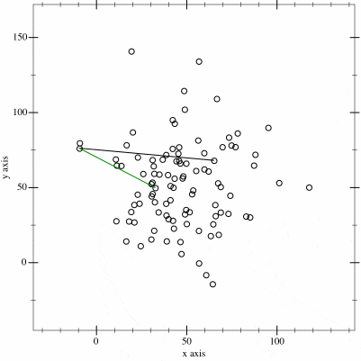

# Convex Hull Algorithm (Jarvis-March)  

## Overview 

This project implements the Jarvis-March algorithm, commonly referred to as the Gift Wrapping algorithm. This algorithm is a straightforward and intuitive method for determining the convex hull of a set of points in a plane. The convex hull, in this context, is defined as the smallest convex polygon that encompasses all given points. 

## How it Works 

The algorithm initiates with a starting point known to be on the convex hull. This point is selected based on having the lowest y-coordinate or being the leftmost in the case of ties.

  

The gif above illustrates the algorithm's progression. It iteratively selects points that contribute to forming the convex hull. Each point is chosen based on having the smallest polar angles relative to the current point. This process continues until the algorithm completes the convex hull by returning to the initial point.

One key aspect of the Jarvis-March algorithm lies in the importance of sorting. Sorting the points based on their polar angles relative to the current point is a crucial step in the algorithm. So, we need to choose our sorting algorithm very carefully if we want to get a efficient convex-hull algorithm

 
 

MstfTurgut  
mstftrgt00@gmail.com
